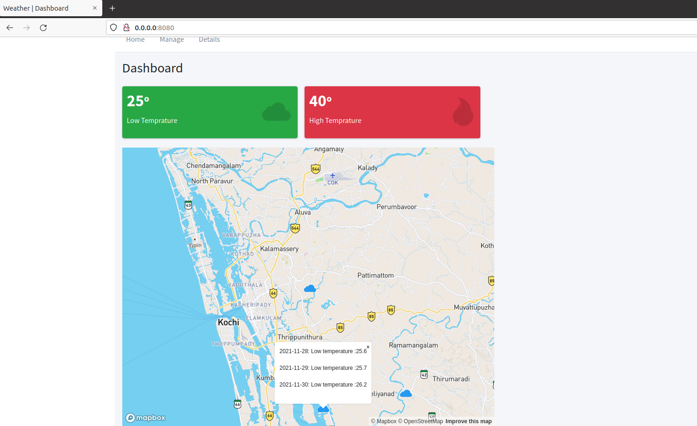
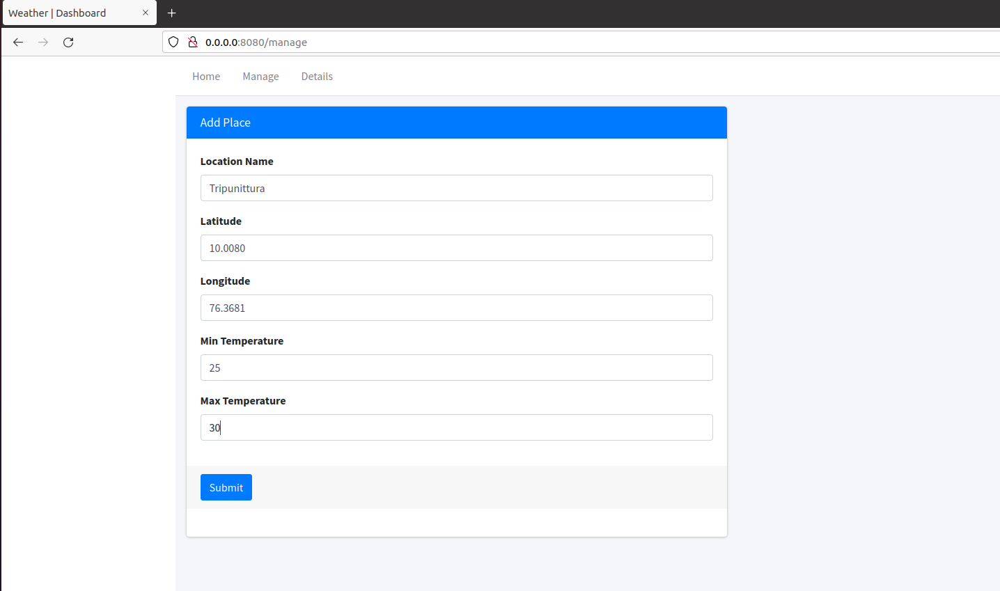
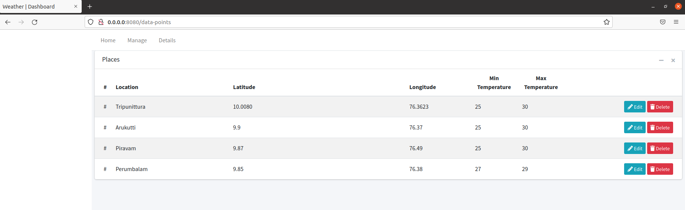

# WeatherForecast
First install packages in requirements.txt

Run the main.py file locally in a system containing mongoDB

command: python3 main.py

On browser go to link localhost:8080

This will show our web app containing a Map. This map plots the data points in DB as cloud icon.
when clicked on that icon the forecast details will appear.

In manage tab you can add new data points. While clicking the submit button it will find the forecast of the given data point based on the latitude and longitude and store it to the database.

In details tab shows all the data points in the DB

#REST APIs

In schema/ManageDatapoints/features_blueprint.py contains the APIs

/data-points/<string:location> : 

    GET: will get all information of given location
    PUT: will update details of given location
    DELETE: will delete the data point

/rerun-forecast/<string:latitude>/<string:longitude>

    POST: Will rerun the forecast from current date based on given lat and long values(to configure the forecast days change the value of FORECAST_DAYS in common/constants.py file)

/data-points

    GET: gets all datapoints in the database
    POST: Adds new datapoint to the database and find forecast

/fetch-points
    
    GET: gets all data points and find the details of datapoints based on min and max temperature to plot on graph.

